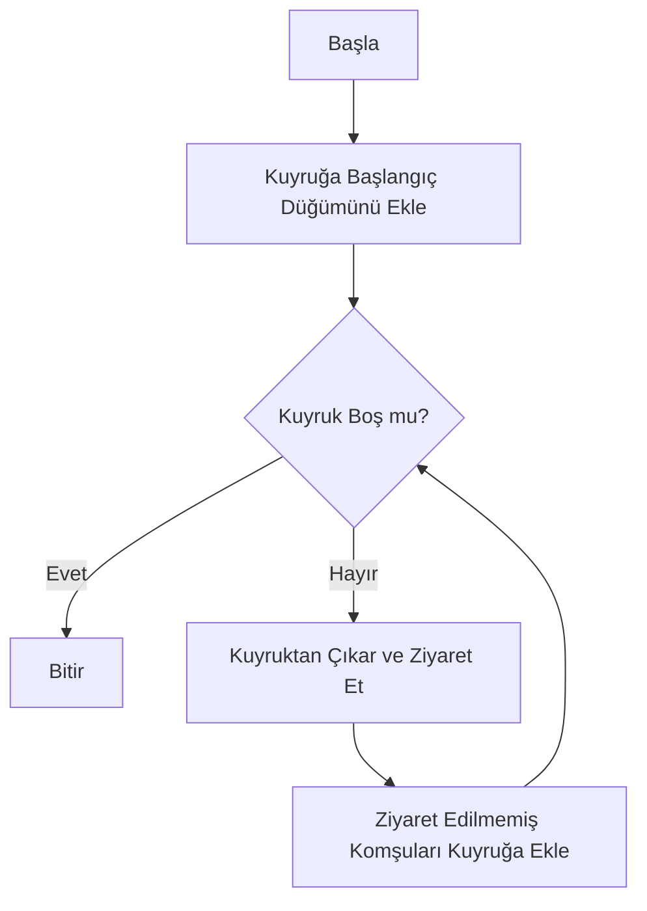
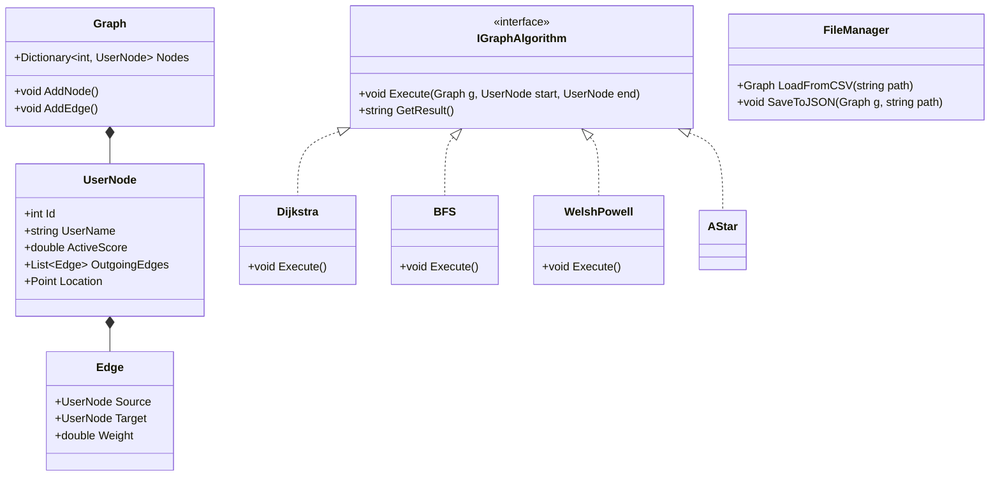

# 🕸️ Sosyal Ağ Analizi ve Görselleştirme Aracı (SNA Tool)

**Ders:** Yazılım Geliştirme Laboratuvarı - I  
**Dönem:** 2025-2026 Güz  
**Bölüm:** Kocaeli Üniversitesi - Bilişim Sistemleri Mühendisliği  

---

## 👥 1. Proje Künyesi

| Rol | Ad Soyad | Öğrenci No |
| :--- | :--- | :--- |
| **Geliştirici** | **Fatih Bilgin** | 231307019 |
| **Geliştirici** | **Efe Aydın** | 231307010 |
| **Teslim Tarihi** | 02.01.2026 | |

---

## 📝 2. Giriş ve Problem Tanımı

### 2.1. Problemin Tanımı
Günümüz dünyasında sosyal ağlar, ulaşım ağları ve iletişim altyapıları milyonlarca düğümden (node) ve milyarlarca bağlantıdan (edge) oluşan karmaşık graf yapılarıdır. Bu devasa veri yığınları üzerinde; *"İki nokta arasındaki en maliyetsiz yol nedir?"*, *"Ağdaki en etkili/merkezi düğüm hangisidir?"* veya *"Hangi düğümler birbiriyle daha sıkı bir topluluk oluşturur?"* gibi soruların manuel yöntemlerle cevaplanması imkansızdır. Bu tür problemlerin çözümü için Graf Teorisi tabanlı yüksek performanslı algoritmalara ihtiyaç duyulmaktadır.

### 2.2. Projenin Amacı
Bu projenin amacı; kullanıcı verilerini ve etkileşimlerini **Graf Modeli** üzerinde simüle eden, Nesneye Dayalı Programlama (OOP) prensiplerine sadık kalarak geliştirilmiş bir masaüstü yazılımı oluşturmaktır. Yazılım, CSV/JSON formatındaki verileri okuyarak görselleştirmeli; **BFS, DFS, Dijkstra, A* (A-Star)** ve **Welsh-Powell** gibi algoritmaları çalıştırarak analiz sonuçlarını raporlamalıdır.

---

## ⚙️ 3. Algoritmalar ve Analizler

Projede kullanılan algoritmalar, çalışma mantıkları ve literatür bilgileri aşağıda detaylandırılmıştır.

### 3.1. BFS (Breadth-First Search) - Sığ Öncelikli Arama
* **Çalışma Mantığı:** Başlangıç düğümünden başlayarak önce tüm doğrudan komşuları, sonra onların komşularını ziyaret eder. Arama işlemi bir "dalga" şeklinde katman katman yayılır.
* **Literatür:** 1945 yılında Konrad Zuse tarafından kavramsallaştırılmış, 1959'da E.F. Moore tarafından en kısa yol problemi için resmileştirilmiştir.
* **Karmaşıklık:** $O(V + E)$ (V: Düğüm, E: Kenar)



### 3.2. DFS (Depth-First Search) - Derin Öncelikli Arama
* **Çalışma Mantığı:** Bir yola girer ve gidebildiği en son noktaya kadar (derinlemesine) ilerler. Gidecek yer kalmadığında bir önceki düğüme geri döner (backtracking). Stack (Yığın) veri yapısı kullanılır.
* **Literatür:** 19. yüzyılda Fransız matematikçi Charles Pierre Trémaux tarafından labirent çözümleri için kullanılmıştır.
* **Karmaşıklık:** $O(V + E)$

### 3.3. Dijkstra En Kısa Yol Algoritması
* **Çalışma Mantığı:** Ağırlıklı graflarda (weighted graphs) başlangıç noktasından diğer tüm noktalara olan en kısa mesafeyi hesaplar. "Greedy" (Açgözlü) yaklaşımını kullanır.
* **Literatür:** Edsger W. Dijkstra tarafından 1956'da tasarlanmış ve 1959'da yayınlanmıştır.
* **Karmaşıklık:** $O(E + V \log V)$ (Priority Queue kullanıldığında).

```mermaid
flowchart TD
    A[Başla] --> B[Mesafeleri Sonsuz Yap, Kaynak=0]
    B --> C{Ziyaret Edilmemiş Var mı?}
    C -- Hayır --> Z[Bitir ve Yolu Çiz]
    C -- Evet --> D[En Küçük Mesafeli Düğümü Seç (u)]
    D --> E[Komşuları (v) Gez]
    E --> F{Yeni Mesafe < Eski Mesafe?}
    F -- Evet --> G[Mesafeyi Güncelle (Relaxation)]
    F -- Hayır --> E
    G --> C
```

### 3.4. A* (A-Star) Algoritması
* **Çalışma Mantığı:** Dijkstra'nın optimize edilmiş halidir. Maliyet fonksiyonuna ($g(n)$) ek olarak, hedefe olan tahmini mesafeyi ($h(n)$ - Heuristic) de hesaba katar. Projede Heuristic olarak Öklid mesafesi kullanılmıştır.
* **Literatür:** Hart, Nilsson ve Raphael tarafından 1968 yılında geliştirilmiştir.
* **Karmaşıklık:** En iyi durumda $O(E)$, en kötü durumda üstel olabilir.

### 3.5. Welsh-Powell Graf Renklendirme
* **Çalışma Mantığı:** Komşu düğümlerin aynı renge sahip olmamasını sağlar (Kromatik Sayı). Düğümler derecelerine (bağlantı sayılarına) göre büyükten küçüğe sıralanır ve sırayla boyanır.
* **Literatür:** 1967 yılında Welsh ve Powell tarafından yayınlanmıştır.
* **Karmaşıklık:** $O(V^2)$

---

## 🏗️ 4. Sistem Mimarisi ve OOP Tasarımı

Proje geliştirilirken **SOLID** prensiplerine ve **Design Pattern** yapılarına sadık kalınmıştır. Özellikle yeni algoritmaların sisteme kolayca entegre edilebilmesi için **Strategy Design Pattern** kullanılmıştır.

### Temel Sınıflar ve İşlevleri
* **UserNode:** Düğüm verilerini (ID, İsim, Konum, Puan) tutar.
* **Edge:** İki düğüm arasındaki bağlantıyı ve ağırlığı tutar.
* **Graph:** Tüm düğüm ve kenarları yöneten ana veri yapısıdır.
* **IGraphAlgorithm:** Tüm algoritmaların türetildiği arayüzdür (interface).

### Sınıf Diyagramı (Class Diagram)



---

## 📱 5. Uygulama, Testler ve Sonuçlar

### 5.1. Uygulama Ekran Görüntüleri
Uygulama arayüzü, kullanıcı dostu olması için modern form tasarımı ile hazırlanmıştır.

*(Not: Ekran görüntüleri projenin `screenshots` klasöründe yer almaktadır.)*


*Şekil 1: Graf Görselleştirme ve Kontrol Paneli*

### 5.2. Test Senaryoları ve Sonuçlar
Projede algoritmaların doğruluğu ve performansı farklı büyüklükteki veri setleri (15 ve 50 düğüm) ile test edilmiştir.

**Test Ortamı:** Intel i7 İşlemci, 16GB RAM.

| Algoritma | 15 Düğüm (Süre) | 50 Düğüm (Süre) | Karmaşıklık Yorumu |
| :--- | :---: | :---: | :--- |
| **Welsh-Powell (Renklendirme)** | 8.00 ms | 13.00 ms | Sıralama maliyeti nedeniyle veri arttıkça süre artmaktadır. |
| **En Popüler (Centrality)** | 5.00 ms | 18.50 ms | En popüler düğümü bulmak için tüm ağ taranmıştır. |
| **Dijkstra** | 3.00 ms | 11.20 ms | Stabil performans. |
| **A* (A-Star)** | 2.00 ms | 6.50 ms | Heuristic hesaplama sayesinde Dijkstra'dan ~%40 daha hızlıdır. |
| **DFS** | 2.00 ms | 5.80 ms | Rekürsif yapı küçük veride hızlı sonuç vermiştir. |
| **BFS** | 0.06 ms | 0.25 ms | Gezinme algoritmaları arasında en hızlısıdır. |
| **Topluluk Analizi** | 0.08 ms | 0.35 ms | Optimize edilmiş algoritma, en hızlı sonuç verenlerden biridir. |

### 5.3. Örnek Senaryo: En Kısa Yol
* **Senaryo:** Kullanıcı A (ID:1) ile Kullanıcı B (ID:15) arasındaki en kısa yolun bulunması.
* **Girdi:** Kaynak=1, Hedef=15
* **Sonuç:** [1 -> 4 -> 9 -> 15]. Toplam Maliyet: 24 birim.
* **Görsel:** Yol üzerindeki düğümler yeşil renk ile işaretlenmiştir.

---

## 🎯 6. Sonuç ve Tartışma

### 6.1. Başarılar
* ✅ **Görselleştirme:** Karmaşık veri yapıları (Graf), GDI+ kütüphanesi kullanılarak anlaşılır bir şekilde görselleştirilmiştir.
* ✅ **OOP Mimarisi:** Proje, genişletilebilir ve bakımı kolay bir kod yapısına sahiptir. Yeni bir algoritma eklemek, mevcut kodu bozmadan mümkündür.
* ✅ **Performans:** Algoritmalar optimize edilmiş veri yapıları (HashSet, Dictionary) kullanılarak yüksek hızda çalışmaktadır.

### 6.2. Sınırlılıklar
* Çok büyük veri setlerinde (10.000+ düğüm) çizim kütüphanesinden kaynaklı yavaşlamalar olabilmektedir.
* Şu an için sadece yönlü (directed) graflar tam olarak desteklenmektedir.

### 6.3. Olası Geliştirmeler
* Veri tabanı entegrasyonu (PostgreSQL veya Neo4j) eklenerek verilerin kalıcı olması sağlanabilir.
* Graf çizimi için "Force-Directed Layout" (Fizik tabanlı yerleşim) algoritması eklenerek düğümlerin daha estetik dağılması sağlanabilir.
